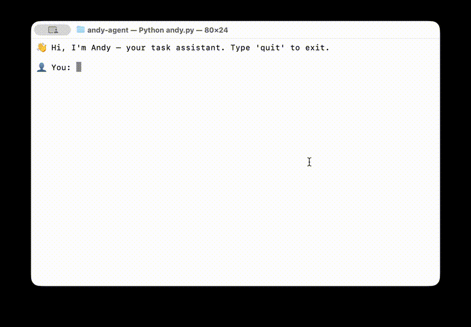
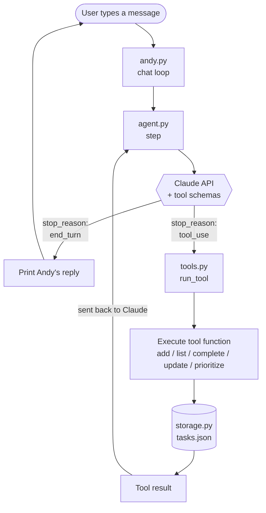

# Andy — A Personal Productivity AI Agent

A command-line AI agent that manages your tasks through natural conversation. Built from scratch with the Anthropic Claude API and Python — no agent frameworks, just the raw tool-use loop.

> "Add 'finish essay' due Friday, high priority — then tell me what to focus on first" → Andy adds it, stores the metadata, and reasons about what's most urgent.

## Demo



## Features

- **Natural language task management** — "I finished the gym one" works as well as "complete task 2"
- **Due dates & priorities** — "add 'finish essay' due Friday, high priority" is understood and stored
- **Smart prioritization** — ask "what should I focus on?" and Andy reasons over due dates and priority levels to recommend what's most urgent
- **Multi-step autonomous reasoning** — Andy plans which tools to call and in what order
- **Persistent storage** — tasks survive between sessions (JSON-backed)
- **Conversational memory** — Andy remembers context across a chat session
- **Six tools**: `add_task`, `list_tasks`, `complete_task`, `update_task`, `get_priorities`, `clear_all_tasks`
- **Resilient tool execution** — a try/except wrapper means a single failing tool never crashes the agent loop

## How it works

Andy is built around the **agent loop** — the core pattern behind every modern AI agent. A tool result always loops *back* to Claude, which then decides the next step. That loop is the whole essence of an agent:



The codebase is split by single responsibility:

| File | Responsibility |
| ------ | ---------------- |
| `andy.py` | Entry point + interactive chat loop |
| `agent.py` | The agent loop — Claude API calls and tool dispatch |
| `tools.py` | Tool implementations and JSON schemas |
| `storage.py` | Loading and saving tasks to disk |
| `prompts.py` | The system prompt that defines Andy's personality |

## Setup

Requires Python 3.10+ and an [Anthropic API key](https://console.anthropic.com).

```bash
# Clone the repo
git clone https://github.com/rahmantj93/andy-agent.git
cd andy-agent

# Create and activate a virtual environment
python3 -m venv venv
source venv/bin/activate    # on Windows: venv\Scripts\activate

# Install dependencies
pip install -r requirements.txt

# Add your API key
echo "ANTHROPIC_API_KEY=your-key-here" > .env

# Run Andy
python andy.py
```

## What I learned

Going in, I thought "AI agent" was a fancy buzzword. Turns out it's a pretty simple idea once you build one yourself. A few things genuinely surprised me along the way:

- **The model doesn't actually do anything.** I assumed Claude would somehow "use" my Python functions. It doesn't. It just *asks* to use them in a structured reply, and my code has to actually run the function and pass the result back. That click moment changed how I think about every AI product I use.

- **The agent loop is shockingly short.** I expected hundreds of lines of orchestration logic. The actual loop is maybe 15 lines: call Claude, check if it wants a tool, run the tool, send the result back, repeat. Everything else is just tools and prompts on top of that loop.

- **The system prompt does more heavy lifting than the code does.** I tweaked one paragraph of instructions and Andy went from sounding like a generic chatbot to sounding like an actual assistant. Most of an agent's "personality" lives in plain English and not in code.

- **Writing good tool descriptions is a skill on its own.** When I added a hint inside the `complete_task` description "if you don't know the task number, call list_tasks first", Claude immediately started doing exactly that without me writing any planning logic. The descriptions aren't documentation; they're instructions to the model.

- **The first real bug taught me more than the working code.** When I split the project into multiple files, my API client broke because the `.env` was loading after the import. Tracking that down forced me to actually understand how Python imports execute, which I'd been hand-waving past for years.

- **Adding a tool means touching three places, not one.** The function, the dispatcher branch, and the schema. I learned this by forgetting the dispatcher line and getting an "unknown tool" error each time. Now I run a mental checklist: function → dispatcher → schema.

The biggest takeaway: building an AI agent from scratch without any framework is the fastest way to actually understand what's happening inside the AI tools we all use every day.

## Roadmap

- ✅ **v0.1** — Core task agent (add, list, complete, clear) with the tool-use loop
- ✅ **v0.2** — Due dates, priorities, task updates, and smart prioritization
- **v0.3** — Google Calendar read-only integration (find free slots)
- **v0.4** — Gmail draft-only integration (read inbox, draft replies)
- **v1.0** — Simple web UI (FastAPI + a single HTML page)

## Built with

- [Anthropic Claude API](https://docs.claude.com) (`claude-haiku-4-5`)
- Python 3.14
- `anthropic` Python SDK
- `python-dotenv` for environment management

## License

MIT
